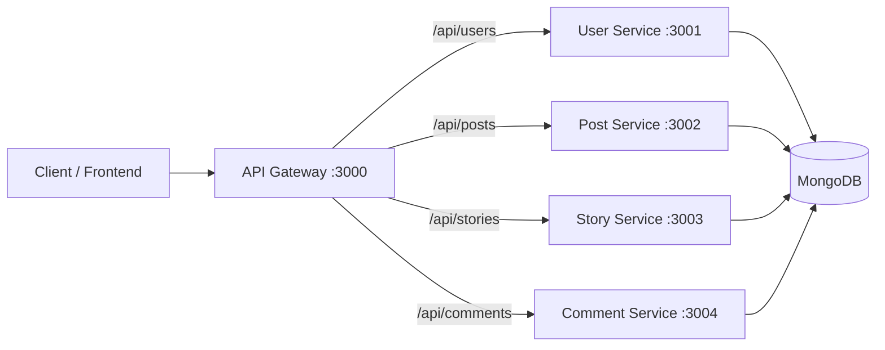

# TP Microservices Architecture

This project is a Node.js microservices backend for a social-media style application.
It is split into independent services (users, posts, comments, stories) behind a single API Gateway.

## Why this architecture

The system is intentionally decomposed by **business domain**:

- **User Service** = identity and social graph (register/login/follow)
- **Post Service** = publication lifecycle (create/feed/update/delete/like)
- **Comment Service** = threaded comments and replies
- **Story Service** = ephemeral content with expiration and views
- **API Gateway** = single public entry point (security + auth + routing)

### Purpose of doing it this way

- **Separation of concerns**: each service owns one clear responsibility.
- **Independent evolution**: each service can be changed/deployed with less risk to others.
- **Fault isolation**: if one service fails, others can continue running.
- **Scalability by need**: high-traffic domains (e.g., posts/comments) can scale separately.
- **Security consistency**: gateway centralizes security middleware and token checks.

## High-level architecture



## Service responsibilities

### 1) API Gateway (`api-gateway`)

Main role: entry point and reverse proxy to internal services.

- Applies security middleware (`helmet`, `cors`, `express-rate-limit`, JSON body parser).
- Applies JWT authentication globally, with public routes:
  - `/api/users/register`
  - `/api/users/login`
  - `/health`
- Proxies traffic to services:
  - `/api/users` → User Service
  - `/api/posts` → Post Service
  - `/api/comments` → Comment Service
  - `/api/stories` → Story Service
- Exposes global health route: `GET /health`.

### 2) User Service (`user-service`)

Main role: authentication + user profile + follow graph.

Core features:

- Register (`POST /api/users/register`) with password hashing (`bcryptjs`).
- Login (`POST /api/users/login`) with JWT issuance.
- Read profile (`GET /api/users/:id`) with followers/following population.
- Follow/unfollow:
  - `POST /api/users/:id/follow`
  - `DELETE /api/users/:id/unfollow`

User model includes `username`, `email`, hashed `password`, `bio`, `avatar`, `followers`, `following`.

### 3) Post Service (`post-service`)

Main role: social feed and post lifecycle.

Core features:

- Create post (auth): `POST /api/posts`
- Public feed with pagination: `GET /api/posts?page=&limit=`
- Read post: `GET /api/posts/:id`
- Update/delete own post (auth):
  - `PUT /api/posts/:id`
  - `DELETE /api/posts/:id`
- User posts: `GET /api/posts/user/:userId`
- Like/unlike (auth):
  - `POST /api/posts/:id/like`
  - `POST /api/posts/:id/unlike`

Model design highlights:

- Visibility levels: `public | friends | private`
- `likedBy[]` + `likesCount` synchronization
- Indexes for feed/user/likes access patterns

### 4) Comment Service (`comment-service`)

Main role: comments and nested replies for posts.

Core features:

- Create comment/reply (auth): `POST /api/comments`
- Get comments by post with pagination:
  - `GET /api/comments?postId=...&page=...&limit=...`
  - `GET /api/comments/post/:postId`
- Get replies of a comment: `GET /api/comments/:id/replies`
- Get one comment: `GET /api/comments/:id`
- Update/delete own comment (auth):
  - `PUT /api/comments/:id`
  - `DELETE /api/comments/:id`

Model design highlights:

- `parentCommentId` enables threading.
- Deletes child replies when a parent comment is deleted.
- Indexes optimized for post and reply retrieval order.

### 5) Story Service (`story-service`)

Main role: temporary stories with views tracking.

Core features:

- Create story (auth): `POST /api/stories`
  - configurable expiry (`expiresInHours`, clamped to 1–48h)
- Public active stories feed: `GET /api/stories`
- User active stories: `GET /api/stories/user/:userId`
- Read active story: `GET /api/stories/:id`
- Record view (auth): `POST /api/stories/:id/view`
- Delete own story (auth): `DELETE /api/stories/:id`

Model design highlights:

- TTL index on `expiresAt` (`expireAfterSeconds: 0`) for auto cleanup.
- Unique viewers logic and `viewsCount` sync.

## Shared and cross-cutting patterns

- Shared auth middleware factory in `shared/middleware/authRequired.js`.
- Each domain service applies:
  - CORS
  - JSON body parsing
  - request logger
  - global error handler
- All services connect to MongoDB using `MONGODB_URI`.
- Gateway and services validate JWT using `JWT_SECRET`.

## Project structure

```text
tp-microservice/
├── api-gateway/
├── user-service/
├── post-service/
├── comment-service/
├── story-service/
├── shared/
└── check-db.js
```

## Environment variables

Create a `.env` file at repository root:

```env
MONGODB_URI=your_mongodb_connection_string
JWT_SECRET=your_super_secret_key

API_GATEWAY_PORT=3000
USER_SERVICE_PORT=3001
POST_SERVICE_PORT=3002
STORY_SERVICE_PORT=3003
COMMENT_SERVICE_PORT=3004
```

## Run locally

### 1) Install dependencies

Install root dependencies:

```bash
npm install
```

Install dependencies for each service:

```bash
cd api-gateway && npm install
cd ../user-service && npm install
cd ../post-service && npm install
cd ../story-service && npm install
cd ../comment-service && npm install
cd ..
```

### 2) (Optional) Validate MongoDB connectivity

```bash
node check-db.js
```

### 3) Start the platform

From repository root:

```bash
npm run dev:all
```

Or run one service at a time:

```bash
npm run dev:gateway
npm run dev:user
npm run dev:post
npm run dev:story
npm run dev:comment
```

## Request flow example

1. Client authenticates via `POST /api/users/login`.
2. User Service returns JWT.
3. Client calls protected routes through API Gateway with `Authorization: Bearer <token>`.
4. Gateway validates token then forwards request to target service.
5. Target service executes domain logic and returns response.

## Notes

- Current setup uses one MongoDB URI shared by all services (logical separation by collections).
- Public endpoints are limited by design (register, login, health); most other actions require JWT.
- This structure is a solid base for next steps like service discovery, centralized logging, and container orchestration.
